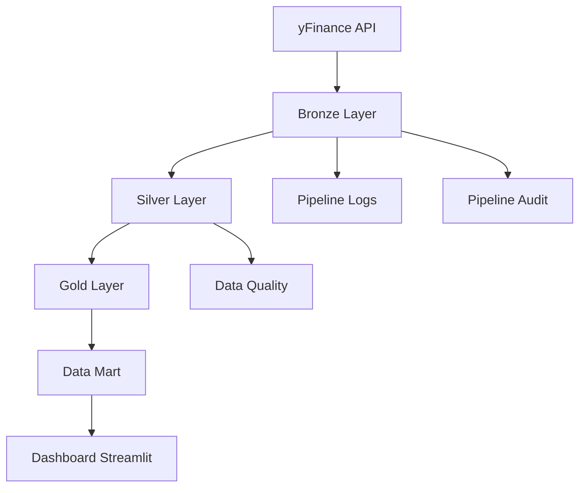
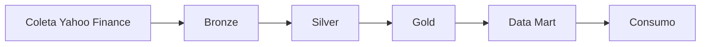
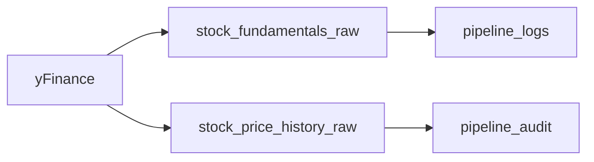
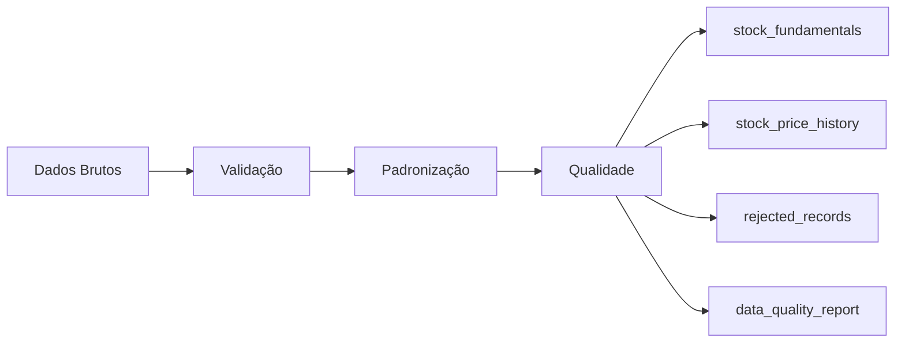
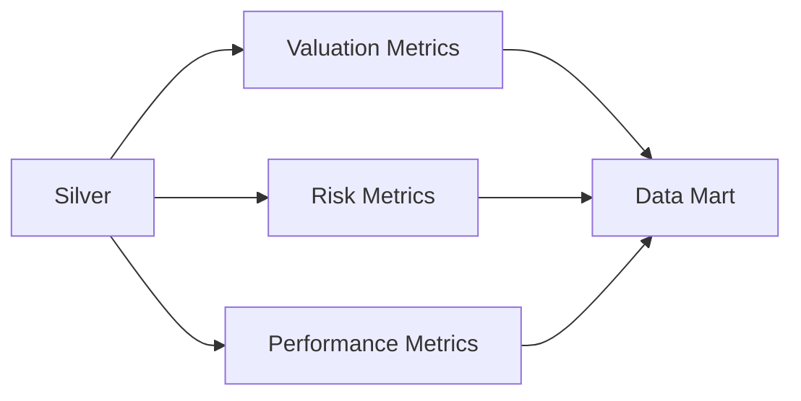
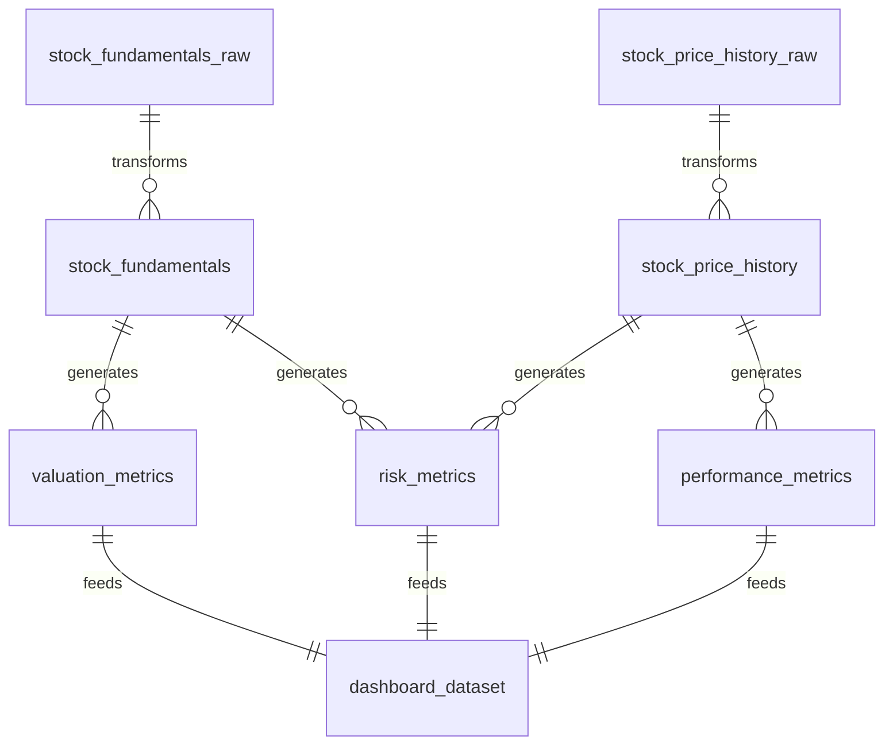

# Visualizações e Arquitetura — B3 Energy Analytics

Este documento pode ser adicionado ao repositório na pasta `docs/` ou utilizado para enriquecer o README principal.

---

# Arquitetura da Solução



## Fluxo de Dados



---

# Arquitetura Medalhão

## Bronze Layer



### Responsabilidades

- Ingestão dos dados brutos
- Armazenamento dos snapshots
- Registro de logs
- Auditoria das execuções

---

## Silver Layer



### Responsabilidades

- Limpeza dos dados
- Validação de regras
- Tratamento de nulos
- Controle de qualidade

---

## Gold Layer



### Indicadores

#### Valuation

- P/L
- P/VP
- EV/EBITDA
- Dividend Yield

#### Risk

- Beta
- Dívida / EBITDA
- Volatilidade

#### Performance

- Retorno 30 dias
- Retorno 90 dias
- Retorno 180 dias
- Retorno 365 dias

---

# Dashboard Analítico

## Página 1 — Overview

### KPIs

- Ativos Monitorados
- Preço Médio
- Dividend Yield Médio
- Beta Médio
- Volatilidade Média

### Visualização

```text
+---------------------------+
| KPI CARDS                 |
+---------------------------+

+---------------------------+
| Risco x Retorno           |
+---------------------------+
```

---

## Página 2 — Valuation

### Gráficos

- Ranking de Dividend Yield
- Ranking de P/L
- Ranking de EV/EBITDA
- Ranking de P/VP

### Exemplo

```text
Dividend Yield

TAEE11  ████████████
EGIE3   █████████
TRPL4   ████████
```

---

## Página 3 — Risk

### Gráficos

- Beta por ativo
- Dívida/EBITDA
- Volatilidade

### Exemplo

```text
Beta

TAEE11  ██
EGIE3   ███
EQTL3   ███████
```

---

## Página 4 — Performance

### Gráficos

- Retorno 30 dias
- Retorno 90 dias
- Retorno 180 dias
- Retorno 365 dias

### Exemplo

```text
Retorno 12 Meses

EQTL3   ███████████████
ELET3   ████████████
TAEE11  ████████
```

---

## Página 5 — Governança

### Monitoramento

- Histórico de Execuções
- Data Quality
- Pipeline Logs
- Auditoria

### Exemplo

```text
Execução     Status

2026-06-12   SUCCESS
2026-06-11   SUCCESS
2026-06-10   SUCCESS
```

---

# Modelo de Dados



---

# Entrega de Valor

A plataforma transforma dados brutos do mercado financeiro em informações analíticas prontas para consumo, permitindo:

- Comparação entre empresas do setor elétrico
- Análise de valuation
- Monitoramento de risco
- Avaliação de performance histórica
- Controle de qualidade dos dados
- Observabilidade do pipeline

O resultado final é uma solução completa de Engenharia de Dados com arquitetura Medalhão, Data Mart analítico e camada de visualização para apoio à tomada de decisão.
