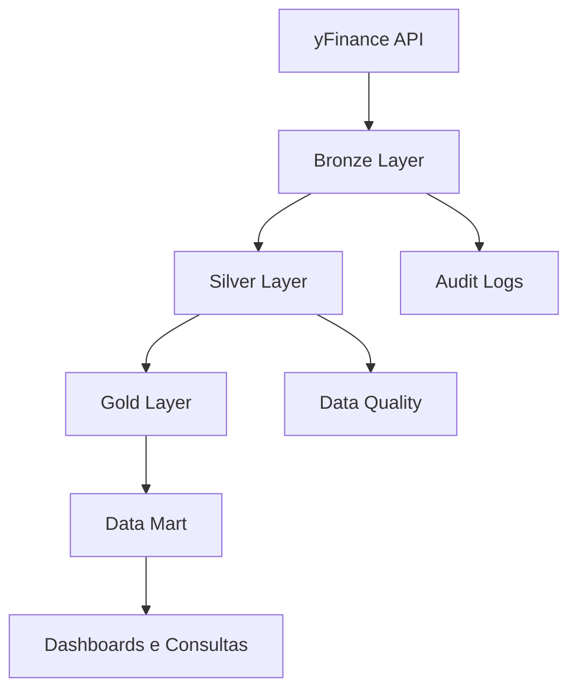
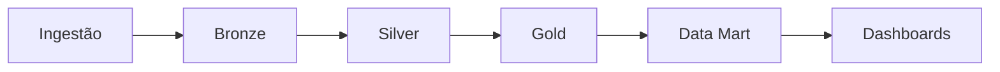

# B3 Energy Analytics Platform

## Visão Geral

Este projeto tem como objetivo construir uma plataforma de dados para análise de empresas do setor elétrico listadas na B3, utilizando conceitos modernos de Engenharia de Dados e Arquitetura Medalhão (Bronze, Silver e Gold).

A solução realiza a coleta automatizada de dados financeiros e históricos de mercado, aplica processos de qualidade e transformação, gera indicadores de valuation, risco e performance, e disponibiliza os resultados para consumo através de consultas analíticas, exportação de dados e dashboards.

O projeto foi desenvolvido integralmente em Python utilizando Google Colab e DuckDB, simulando um ambiente de Data Lakehouse para processamento batch.

---

## Objetivos

* Centralizar informações financeiras de empresas do setor elétrico da B3.
* Implementar uma arquitetura de dados em múltiplas camadas.
* Aplicar boas práticas de Engenharia de Dados.
* Gerar indicadores financeiros para análise de investimentos.
* Disponibilizar os dados para consumo analítico.
* Demonstrar competências em ETL, modelagem de dados e visualização.

---

## Ativos Monitorados

O pipeline realiza a coleta automática dos seguintes ativos:

| Empresa       | Ticker    |
| ------------- | --------- |
| Taesa         | TAEE11.SA |
| Engie Brasil  | EGIE3.SA  |
| ISA CTEEP     | TRPL4.SA  |
| Copel         | CPLE6.SA  |
| Cemig         | CMIG4.SA  |
| Eletrobras    | ELET3.SA  |
| Eletrobras PN | ELET6.SA  |
| Alupar        | ALUP11.SA |
| Energisa      | ENGI11.SA |
| Equatorial    | EQTL3.SA  |
| Neoenergia    | NEOE3.SA  |

---

## Arquitetura da Solução



---

## Stack Tecnológica

| Categoria      | Tecnologia   |
| -------------- | ------------ |
| Linguagem      | Python       |
| Banco de Dados | DuckDB       |
| Ingestão       | yFinance     |
| Transformação  | Pandas + SQL |
| Visualização   | Plotly       |
| Dashboard      | Streamlit    |
| Ambiente       | Google Colab |
| Versionamento  | Git/GitHub   |

---

## Arquitetura Medalhão

### Bronze Layer

Camada responsável pela ingestão dos dados brutos.

#### Tabelas

```text
bronze.stock_fundamentals_raw

bronze.stock_price_history_raw

bronze.pipeline_logs

bronze.pipeline_audit
```

#### Responsabilidades

* Coleta dos dados da API Yahoo Finance.
* Armazenamento sem transformações.
* Controle de execução do pipeline.
* Registro de logs e auditoria.

---

### Silver Layer

Camada responsável pela limpeza e validação dos dados.

#### Tabelas

```text
silver.stock_fundamentals

silver.stock_price_history

silver.rejected_records

silver.data_quality_report
```

#### Responsabilidades

* Validação de campos obrigatórios.
* Tratamento de registros inválidos.
* Padronização dos dados.
* Monitoramento da qualidade.

---

### Gold Layer

Camada analítica contendo indicadores calculados.

#### Tabelas

```text
gold.valuation_metrics

gold.risk_metrics

gold.performance_metrics
```

#### Indicadores de Valuation

* P/L (Price Earnings Ratio)
* P/VP (Price to Book)
* EV/EBITDA
* Dividend Yield

#### Indicadores de Risco

* Beta
* Dívida Líquida / EBITDA
* Volatilidade

#### Indicadores de Performance

* Retorno 30 dias
* Retorno 90 dias
* Retorno 180 dias
* Retorno 365 dias

---

### Data Mart

Tabela consolidada para consumo analítico.

#### Tabela

```text
mart.dashboard_dataset
```

#### Campos Principais

```text
ticker

company_name

current_price

pe_ratio

pb_ratio

ev_ebitda

dividend_yield

beta

debt_ebitda

volatility

return_30d

return_90d

return_180d

return_365d

snapshot_date
```

---

## Pipeline de Dados



---

## Qualidade dos Dados

O pipeline implementa validações para garantir a consistência das informações processadas.

### Regras Aplicadas

#### Fundamentais

```text
ticker IS NOT NULL

current_price > 0

market_cap > 0

snapshot_date IS NOT NULL
```

#### Histórico

```text
ticker IS NOT NULL

trade_date IS NOT NULL

close > 0

volume >= 0
```

### Monitoramento

As métricas de qualidade são armazenadas em:

```text
silver.data_quality_report
```

Registros inválidos são enviados para:

```text
silver.rejected_records
```

---

## Observabilidade

### Logs

```text
bronze.pipeline_logs
```

Informações registradas:

* Etapa executada
* Status
* Mensagem
* Timestamp

### Auditoria

```text
bronze.pipeline_audit
```

Informações registradas:

* Run ID
* Horário de início
* Horário de término
* Quantidade de registros processados
* Status da execução

---

## Visualizações

O projeto disponibiliza análises através de gráficos desenvolvidos com Plotly.

### Indicadores Disponíveis

* Ranking de Dividend Yield
* Ranking de P/L
* Ranking de EV/EBITDA
* Ranking de Beta
* Retorno acumulado em 12 meses
* Matriz de Risco x Retorno
* Indicadores de Qualidade dos Dados

---

## Estrutura do Projeto

```text
B3-Energy-Analytics/

│
├── notebooks/
│   └── pipeline_colab.ipynb
│
├── data/
│   └── energy_market.duckdb
│
├── exports/
│   └── dashboard_dataset.csv
│
├── dashboard/
│   └── app.py
│
├── images/
│   └── arquitetura.png
│
├── README.md
│
└── requirements.txt
```

---

## Como Executar

### 1. Clonar o Repositório

```bash
git clone https://github.com/seu-usuario/b3-energy-analytics.git

cd b3-energy-analytics
```

### 2. Instalar Dependências

```bash
pip install -r requirements.txt
```

### 3. Executar Pipeline

Executar o notebook principal no Google Colab:

```text
pipeline_colab.ipynb
```

### 4. Executar Dashboard

```bash
streamlit run app.py
```

---

## Resultados Obtidos

O projeto permite:

* Centralização de dados financeiros do setor elétrico.
* Construção de pipeline batch utilizando Arquitetura Medalhão.
* Monitoramento da qualidade dos dados.
* Geração automatizada de indicadores financeiros.
* Disponibilização de informações para análise e tomada de decisão.
* Simulação de um ambiente moderno de Data Lakehouse utilizando DuckDB.

---

## Melhorias Futuras

* Implementação de carga incremental.
* Histórico completo de snapshots.
* Cálculo de Sharpe Ratio.
* Cálculo de Maximum Drawdown.
* Integração com FastAPI.
* Deploy do dashboard em ambiente cloud.
* Automatização com Prefect ou Apache Airflow.

---

## Autor

**Arthur Virgilio**

Projeto desenvolvido para fins acadêmicos e portfólio, aplicando conceitos de Engenharia de Dados, Mercado Financeiro e Analytics.
